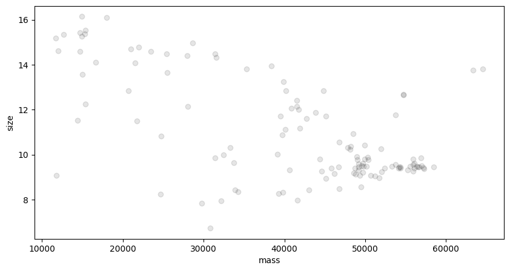
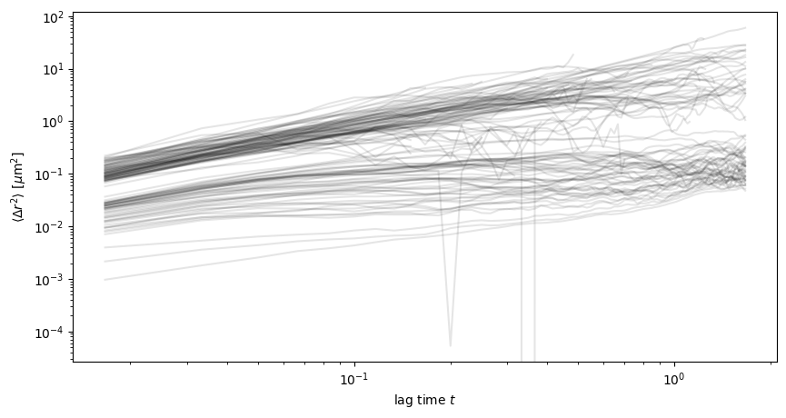

# Optical Tweezers Visual Interface

### Contents:
- [About the Visual Interface](#about-the-visual-interface)
- [Installation & Required Dependencies](#installation--required-dependencies)
    - [OOB Use of the Visual Interace](#oob-usage-of-visual-interface)
- [Auto Mode Usage](#auto-mode)
- [Tracking Calibration Instructions](#tracking-calibration-trackpycalibrationnotebookipynb)
- [Programming Guide](#programming-guide)
    - [Device Controllers](#controllers)
    - [The EventHandler Object](#the-eventhandler-object)
    - [The TrackingHandler Object](#the-trackinghandler-object)
    - [The TrackingHandler Object](#the-trackinghandler-object)
    - [Individual Device Controller Methods](#individual-device-controller-methods)


## About the Visual Interface
This repository features a visual GUI programmed in Python which permits the visual detection of microscale particles and nanoscale diffraction patterns. It's primary backends are supported by:
- [OpenCV](https://docs.opencv.org/4.x/index.html) (for all Image processing tasks)
- [pypylon](https://github.com/basler/pypylon) (for communicating with BASLER brand microscope cameras)
- [pythonnet](https://github.com/pythonnet/pythonnet) (the Python .NET SDK)
- Thorlab's [Kinesis SDK](https://www.thorlabs.com/software_pages/ViewSoftwarePage.cfm?Code=Motion_Control) (for Thorlabs component interfacing)
- Arduino's [PyFirmata](https://github.com/berndporr/pyFirmata2) (For Serial Arduino USB Communication)
- various other support packages (numpy, matplotlib, pandas, ...) detailed in the Installation section.

The goal of this project is the autonomous control of the entire Raman Scattering data collection process for nano-scale particles (such as [extracellular vesicles](https://en.wikipedia.org/wiki/Extracellular_vesicle)), while simultaneously conducting Brownian trajectory analysis for individual particles. 

Such trajectory analysis is then later applied to service the calculation of individual particle radii and diffusivity coefficients. These calculations allow for the labelless and efficient classification of particles undergoing Raman analysis.

**Developer's Note**: At the moment, this code has been tested on various microscale level samples with great accuracy in their tracking and radii predictions to theoretical values, however has yet to be tested with visual data from nanoscale diffraction patterns. Such developments are a work in progress once an appropriate nanoscopic visual input method is in place.

---
## Installation & Required Dependencies

This project runs natively in **Python 3.12.10**. 

Using this version of Python or a later version is highly recommended to ensure minimal complication with package compatibility.

#### Required PIP Package Dependencies:

- [Numpy](https://pypi.org/project/numpy/) (Used for fast array manipulation––specifically in tracking data management)
- [Matplotlib](https://pypi.org/project/matplotlib/) (Used for generating tracking plots/histograms)
- [Pandas](https://pypi.org/project/pandas/) (Used to manipulate .csv files returned during the video analysis subprocess)
- [Pims](https://pypi.org/project/PIMS/) (PIMS is a Python Image Sequence package allowing for various video/image export formats)
- [TQDM](https://pypi.org/project/tqdm/) (TQDM is a progress bar package, specifically for the tracking progress)
- [Trackpy](https://pypi.org/project/trackpy/) (Trackpy is the backend for all things tracking)
- [PyAV](https://pypi.org/project/av/) (Used for exporting video to smaller formats)
- [Numba](https://pypi.org/project/numba/) (Allows the use of machine-code decorators to accelerate the tracking process)
- [PyPylon](https://pypi.org/project/pypylon/) (PyPylon interfaces with BASLER cameras as a wrapper for the Pylon SDK)
- [OpenCV](https://pypi.org/project/opencv-python/) (OpenCV is the primary backend of the visual interface & image processing)
- [PythonNET](https://pypi.org/project/pythonnet/) (PythonNET allows for interfacing with Thorlabs instruments and the Kinesis SDK)
- [PyFirmata2](https://pypi.org/project/pyFirmata2/) (PyFirmata2 enables serial arduino communication responsible for setup LED control)
- [PySerial](https://pypi.org/project/pyserial/) (PySerial permits USB serial communication necessary for interfacing with an external Arduino)
- [Arduino-Python3](https://pypi.org/project/arduino-python3/) (Further Arduino compatibility package)

#### Kinesis SDK Installation Instructions:

The **Kinesis SDK** is a Software Development Kit created by Thorlabs to allow easy interfacing with Thorlabs components. 

- It can be downloaded from the [Thorlabs](https://www.thorlabs.com/) website under **[Motion Control Software](https://www.thorlabs.com/software_pages/ViewSoftwarePage.cfm?Code=Motion_Control)**.

Ensure that the SDK folder (\Thorlabs\Kinesis) is installed in a convenient location. Ensure also that the Kinesis folder contains three folders: 

- Database
- Drivers
- Firmware Update Utility

These folders should be followed by many **.dll** packages.

Ensure that the following **.dll** packages are present in your Kinesis folder:
- _Thorlabs.MotionControl.DeviceManagerCLI.dll_
- _Thorlabs.MotionControl.GenericMotorCLI.dll_
- _Thorlabs.MotionControl.KCube.SolenoidCLI.dll_

To ensure that the program recognizes your Kinesis SDK, navigate to _Hardware_Interfacing\KSC101Control\KSC101Interface.py_ and ensure that the proper path is placed in the **kinesis_path** variable.

```python
import clr
import os
import time
kinesis_path = r"YOUR_PATH_HERE"
...
```

After this the installation of the Kinesis SDK is complete.

#### pyFirmata2 Installation & Arduino Setup:

**PyFirmata2** is a Python interface for the Firmata protocol. It allows for USB serial communication with the Arduino through Python. 

As this project deals with an Arduino for setup LED control, it is necessary to perform an initial configuration of the Arduino such that it will work properly.

To successfully configure a new Arduino, perform the following steps:

1. Install the [Arduino IDE](https://www.arduino.cc/en/software/) for your OS.
2. If you are on Windows/Linux also install the [CH340 driver](https://sparks.gogo.co.nz/ch340.html) for proper serial interpretability.
3. Restart your computer to complete installation of the drivers.
4. Open the Arduino IDE.
5. Connect your Arduino Board via USB to your computer.
6. You should now be able to select the Arduino under the _Select Board_ panel. If this does not show up, try using a different USB port, restarting your computer, or reinstalling the IDE and CH340 drivers, ensuring they are compatible with your system version.
7. Once the Arduino IDE recognizes your Arduino Board, ensure proper communication.
8. Open File/Examples/Basics/Blink
9. Load this onto the Arduino. If the onboard LED begins to blink, your Arduino is properly connected.
10. Now under File/Examples, look for a dropdown for **Firmata** and open the **StandardFirmata** sketch. If the dropdown does not appear, navigate under Sketch/Include Library/Manage Libraries, and search for Firmata. Install as usual, and now the Firmata dropdown should show under File/Examples.
11. Load the StandardFirmata sketch onto the Arduino, and close the Arduino IDE.
12. In the project directory, open _Hardware_Interfacing\LedD1BDriverControl\blink.py_ and run the script. The Arduino should now blink, and the setup of pyFirmata2 is complete.

Further StandardFirmata installation resource: [https://roboticsbackend.com/arduino-standard-firmata-tutorial/](https://roboticsbackend.com/arduino-standard-firmata-tutorial/)
    
---

## OOB Usage of Visual Interface

The visual interface supports a multitude of user-convenient features alongside a few interactivity modes.

Upon the initial startup of the visual interface, the user will notice a few on-screen annotations:

// Image to go here// 

- Overlayed detection of particles (green circles with red center)
- A yellow bounding detection box in the top left of the screen
- A green text in the top left stating how many particles are present inside of the yellow bounding box.
- An indication that the visual interface is set to 'MANUAL' mode.
- Two sliders responsible for the control of the detection sensitivity (larger will detect less particles), and the max/min radius of detected particles–in pixels.

#### Important Default Keybinds *(modifiable in EventHandling.py under handle_key method)*:
- **'q'** is used to QUIT the visual interface.
- **'c'** is used to toggle a center crosshair, used for optical alignment/calibration.
- **'s'** allows the user to take an **unannotated full resolution screengrab**, that which the BASLER camera or Webcam currently captures. The resultant screengrab is stored conveniently in the "\Screenshots\\.." folder.
- **'r'** is used to start/stop an **unannotated full resolution screen video capture**, stored in a "\Recordings\\.." directory.
- **'e'** is used to enter EDITING MODE, allowing the adjustment of the yellow detection bounding box using click & drag directly on the screen.
- **'a'** toggles between MANUAL MODE and AUTO MODE modes (more in detail below).
- **'o'** opens and closes the SH05R/M shutter toggleably when interface is in MANUAL MODE.

## Auto Mode:

AUTO MODE is where the main functionality of this visual interface shines. Once AUTO MODE is enabled, the complete autonomous control of the system will begin, as demonstrated in the control flow diagram below. 

**Ensure that once enabled, the detection bounding box is tightly positioned about the optical trap location, such that it turns blue/detected when a particle is present in the trap.** This can be done manually using EDIT MODE.


AUTO SHUTTER mode works to automatically wait for optically trapped particles, turn off onboard LED's to allow the Raman measurements to take place, turn on and off the optical tweezers, and analyze individual particle trajectories which were Raman measured. All of the control flow logic and timing is stored within the **EventHandler** class in the **\Control_Flow\EventHandling.py** file. Here, the member variables controlling the timing of each stage can be updated manually, and extra interfacing can be added at each stage of the measurement process respectively.

```python
...
# The following member variables control the timing of the AUTO MODE pipeline in the EventHandler class.
self.TRAP_CONFIRMATION_TIME = ...
self.MEASUREMENT_TIME = ...
self.DISPERSAL_WAIT_TIME = ...
self.LED_ON_TIME = ...
...
```

**To terminate AUTO MODE, simply press 'a' again to revert to MANUAL MODE**.

---

## Tracking Calibration (trackpycalibrationnotebook.ipynb)

It is likely during change of setup that the tracking pipeline will require recalibration to ensure its accuracy. 

To facilitate this process and the tweaking of parameters, a Jupyter Notebook has been made which allows for users to visualize each step of the tracking process, and dynamically tweak tracking parameters. To begin, upload a raw video captured of the vesicles that you wish to calibrate your tracking pipeline to. In the tracking preprocess there are 5 main calibration steps:

#### 1.  Brightness Thresholding & Mask Calibration

Once the video is uploaded, the first important feature we should look at is the scale and brightness of the particles we wish to detect on the camera. 

The trackpy.locate function takes in 3 main parameters: _diameter, invert, minmass_:
- Diameter: Here we pass in an estimate for the pixel-wise diameter of the particles we wish to track. This tells the tracking backend the scale we should look for.
- Invert: This is a boolean value which would be marked as true for the detection of relatively dark particles, and false if looking for bright spots.
- Minmass: Trackpy denotes the total brightness value of a target as its visual **mass**. To differentiate the darker background to the particles, we set a minimum brightness threshold the particles must achieve. All targets under this threshold are not considered for trajectory analysis, so this is a very important parameter.

For precise and more numerical computations, the Jupyter Notebook features a histogram visualization which aids to determine the proportion of specific brightness levels on the detection algorithms first guess. 

Visual analysis of these thresholding and mask predictions can be performed under 'Cleaning up the Data' on the lines:

```python
f_thresholded = tp.locate(frames[0], diameter=..., invert=..., minmass=...)
tp.annotate(f_thresholded, frames[0])
...
```

After a qualitatively accurate result has been achieved, transfer the chosen parameters to the 'Locate features in all frames', where a multiprocessed batch location algorithm will detect all particle locations for all frames.

```python
frames = list(frames) # load all frames into RAM
f_batch = tp.batch(frames, diameter=..., minmass=..., invert = ...)
```

#### 2.  Trajectory Linkage and Memory Tweaking

The previous f_batch function returns a datafram containing the exact pixel locations of every detected particle for all frames given. However, these positions are not particle-wise labelled and must be linked/enumerated such that each trajectory is a distinguishable characteristic for each particle. This linkage is performed under 'Link the gathered trajectories' in the notebook using the _trackpy.link_ method:

```python
trajectories = tp.link(f_batch, search_range=..., memory=...)
...
```

The two parameters to be calibrated here are the search_range (in pixels) and the frame memory. 

- The **search range** parameter characterizes the maximum pixel distance that a particle can travel in a single frame to still be considered part of the same trajectory (for faster moving particles this should be larger).

- The **memory** parameter controls the maximum number of frames that a particle can not be detected for before the particle is considered lost (for more noisy data this should be higher for longer trajectories).

#### 3.  Ephemeral Trajectory Thresholding

It is likely that there will be some detected noise in trajectories leading to single frame, or perhaps <10 frame trajectories that are unvaluable to the final radii calculations. These ephemeral trajectories can be filtered by setting a minimum frame threshold for trajectories in the **trackpy.filter_stubs** function used in the notebook under 'Filter out stub/ephemeral trajectories'. 

```python
t1 = tp.filter_stubs(trajectories, threshold=...)
```
With noisy data, it may be important to set this value higher.

#### 4.  Further cluster detection and custom Thresholding

In the case where a mixing of different particles is present with slightly different visual characteristics, it is possible to perform custom thresholding through the visualization of specific feature pairs. The trackpy module automatically provides a variety of information about each detected particle, including:

- mass (average brightness)
- size (pixel diameter)
- ecc (eccentricity)
- raw_mass (total brightness

These features can be plotted in pairs, such as (mass/size) or (raw_mass/ecc) to qualitatively discern these two types of particles graphically, which may then be separated from the trajectories dataframe through the use of an inequality. This visualization can be done in the notebook under 'Further filtering through feature detection'. For example, the following code plots the average mass vs average size of each particle across their full trajectories, and displays a plot.

```python
plt.figure()
tp.mass_size(t1.groupby('particle').mean())
...
```




#### 5.  Visual Pixel Density / FPS configuration

The last step is the most important for obtaining accurate radii and diffusivity results. The algorithm used must translate pixels to micrometers and frames to seconds in order to correctly estimate radii and diffusivity in SI units. To do this, the $\mu$m/pixel of microscope being used and the FPS of the video used **must be correctly passed to the imsd and emsd functions**.

```python
im = tp.imsd(tm, mpp=..., fps=...)
em = tp.emsd(tm, mpp=..., fps=...)
...
```
The imsd and emsd functions return plot data for the mean squared displacement against lag time for the individual partiles and the ensemble mean, respectively. 

For IMSD plots, all trajectories are simultaneously plotted. These are often noisy due to the gaussian noise present in brownian motion.



EMSD plots however are quite smooth, as they are constructed as the ensemble mean of all trajectories, thereby mitigating the Gaussian noise. For diffusive particle behavior, this plot will be approximately linear.


After all 5 steps are complete, you will have successfully calibrated the trajectory analysis backend to allow for precise particle radius calculation.

---
# Programming Guide


## Controllers
All hardware interfacing is done through **controller classes**, which communicate on a higher level with the original packages responsible for hardware interfacing and OpenCV frontend. 

The current **controller classes** present in this project are:

- BaslerCameraController (interfaces with the BASLER camera)
- KSC101Controller (interfaces with the KSC101 Solenoid Controller for Shutter Control)
- ArduinoLEDController (interfaces with Arduino)
- WebcamController (interfaces with a USB Webcam in replacement from a BASLER camera)
- WindowController (interfaces with the OpenCV frontend to produce annotations on the visual interface)

### Controller Initialization & Release

To initialize a controller, one first creates a class instance and calls its initialization function.
A sample initialization of a Basler Camera Controller for example would look like this.

```python
import Hardware_Interfacing.BaslerCameraControl.BaslerCameraInterface

BaslerCameraController = Hardware_Interfacing.BaslerCameraControl.BaslerCameraInterface.BaslerCameraController()
BaslerCameraController.initialize()

... CODE HERE ...

BaslerCameraController.release()
```

Only after the controller has been initialized can the rest of the interfacing member functions be used properly. 
It is also important to call a controllers destructor at the end to ensure proper releasing of the hardware. As seen in the code above, one does so by calling the _.release()_ member function.


Some controllers have specific parameters that must be passed to facilitate initialization. For example, the KSC101 requires a KSC101 device object which must first be initialized.

```python
# Create Instances of each Device to pass into controller
KSC101 = Hardware_Interfacing.KSC101Control.KSC101Interface.CreateDevice("68801184")
KSC101Controller = Hardware_Interfacing.KSC101Control.KSC101Interface.KSC101Controller(KSC101)

# Initialize the Controller
KSC101Controller.initialize()

... CODE HERE ...

KSC101Controller.release()
```
## The EventHandler Object

This project manages all of its interactivity, timing, and automation through the _EventHandler_ class.

The _EventHandler_ class contains all logic necessary to process and parse keyboard and mouse input and device control. It is initialized with access to all device controllers in order to maintaint complete control of the automation.

To instantiate the EventHandler object, one must first initialize all controllers used in the script, that is: **KSC101Controller, WindowController, ArduinoLEDController, and a Camera controller (Webcam or BASLER).**

A sample initialization of an event handling pipeline would be structured in the following way:

```python
import Hardware_Interfacing.KSC101Control.KSC101Interface
import Hardware_Interfacing.WebCameraControl.WebcamInterface
import Hardware_Interfacing.LedD1BDriverControl.ArduinoLEDInterface
import VisualInterface_Frontend.WindowInterface
import Control_Flow.EventHandling
import cv2

if __name__ == "__main__":
    # Initialize the solenoid controller device
    KSC101 = Hardware_Interfacing.KSC101Control.KSC101Interface.CreateDevice("68801184")

    # Create all controller objects
    KSC101Controller = Hardware_Interfacing.KSC101Control.KSC101Interface.KSC101Controller(KSC101)
    webcam = Hardware_Interfacing.WebCameraControl.WebcamInterface.WebcamController()
    window = VisualInterface_Frontend.WindowInterface.WindowController("NH's Particle Detector", 2)
    ledController = Hardware_Interfacing.LedD1BDriverControl.ArduinoLEDInterface.ArduinoLEDController(3, 'COM5')
    
    # Initialize all controller objects
    KSC101Controller.initialize()
    ledController.initialize()
    webcam.initialize()
    window.initialize()

    # Initialize an Event Handler with all controllers passed.
    event_handler = Control_Flow.EventHandling.EventHandler(window, webcam, KSC101Controller, ledController)
    
   while True:
        key = cv2.waitKey(1) & 0xFF
        action - event_handler.handle_key(key) # This is one of the event handler capabilities. It determines what key inputs control in the setup.
        if action == 'quit':
            break 
```

At the moment the EventHandler class performs two main duties: Keyboard Input Handling, and AUTO MODE control.

### Creation of custom key input methods:

To create a custom method to be performed upon a key press, the EventHandler class can be modified under its _handle_key_ method. 

Out of the box, there are already quite a few interactivity tools implemented. For example, this handle key section controls camera recording by pressing **'r'**:

```python

def handle_key(self, key):
...
    elif key == ord('r'):
        if not self.camera.is_recording:
            self.camera.startRecording()
            self.window.is_recording = True
        else:
            self.camera.stopRecording()
            self.window.is_recording = False
...
```
In principle, one can simply introduce a new method corresponding to a specific key by appending an elif statement containing the expression:
```python
elif key == ord('key desired');
...
```
followed by the desired controller methods.

In theory, any method can be implemented combining any number of controllers, as long as they are passed as member objects to the EventHandler class. The EventHandler object allows for all control to be compactly stored in one location for easy readability and access for debugging.

### Modification of the AUTO MODE control flow:

The AUTO MODE control flow is completely controlled by the EventHandler class in in its _process_auto_mode_ method. For proper use, process_auto_mode should be called every iteration in the main loop of the program. It's arguments are _particle_in_box_ and _verbose_. This means that the frame must be grabbed from an appropriate camera controller before processing.

#### AUTO MODE Event Handling Implementation:
Below is a (while True:) loop containing the process_auto_mode method correctly:

```python
... NECESSARY INITIALIZATION CODE ...

while True:
    # READING FRAMES CORRECTLY #
    ret, frame = webcam.read()
    if not ret:
        print("Failed to capture frame.")

    # This line performs elementary circle detection and overlays this onto the screen, while also saying if a particle is in the box!
    frame, particle_in_box = window.annotateCircleDetect(frame)

    frame = window.annotateOverlay(frame) # This line annotates the visual interface with the bulk of the test annotations.

    # EVENT HANDLING
    if event_handler.auto_mode_enabled == True: # check that auto mode is on.
        event_handler.process_auto_mode(particle_in_box, verbose = False)

    key = cv2.waitKey(1) & 0xFF
    action = event_handler.handle_key(key)
    if action == 'quit':
        break

... NECESSARY RELEASE CODE ...  
```
#### Modification of Control Flow:

As shown in the aforementioned diagram indicating the control flow of this visual interfaces' AUTO MODE (see above), the pipeline is divided into 3 main subprocesses:

1. Waiting for Capture
2. Initializing and Performing Raman Measurement
3. Waiting for Dispersal

At the beginning and end of each of these stages, different controller methods are called across the system to ensure the automated process runs smoothly (see control flow diagram above).

If one desires perhaps in the future to add more controller methods, the implementation of such is near trivial.

To manage the timings of each stage, a One Hot Encoding scheme of the current control flow sub process is used. The three boolean values which are used to encode the current control flow state are: _waiting_for_particle, waiting_for_measurement_, and _waiting_for_dispersal_.

When one of these is set to True, the others are naturally False. The True-set boolean is considered the current subprocess. In the _process_auto_mode_ method, one can clearly distinguish the separate methods for each subprocess indicated by the elif statemets structured as below:

```python
def process_auto_mode(self, particle_in_box: bool, verbose=True):
    if self.waiting_for_particle:
        ...
    elif self.waiting_for_measurement:
        ...
    elif self.waiting_for_dispersal:
        ...
```

To add some controller method to any stage, one would simply place their controller method calls in the areas denoted with the ellipses, and update any member control flow variables respectively.

The entire process has been made as intuitive as possible to ensure easy use and future modification.

## The TrackingHandler Object

This project uses a _TrackingHandler_ object to handle all tracking backend calculations responsible for the analysis of Brownian Trajectories, calculation of Diffusion coefficients, and creation of plots. It is where most of the data taken in this project is sourced. One can also think of the _TrackingHandler_ object as a wrapper class for the [TrackPy](https://soft-matter.github.io/trackpy/v0.6.4/) module. It contains all methods necessary for individual mean squared displacement plot construction, ensemble mean squared displacement, as well as individual particle tracking (needed for trapped particle radii calculations). 

The _EventHandler_ class is initialized in the same way that one initializes the _EventHandler_ class. It takes it many arguments however which determine how the _TrackingHandler_ treats videos and performs tracking (parameters such as sensitivity, radii predictions, trajectory memory, minimum brightness, etc.). A sample initialization of a _TrackHandler_ object would be performed as follows:

```python
import Tracking_Backend.TrackingInterface

track_handler = TrackingBackend.TrackingInterface.TrackingHandler(
    invert = False,
    minmass = 10000,
    pix_diameter = 51,
    traj_memory = 5,
    traj_search_range = 10,
    stub_traj_length = 5,
    microns_per_pix = 0.07289795,
    fps = 30)
```

The parameters of the TrackHandler class controll the following:

- Invert (Determines whether the tracker looks for bright spots (False) or dark spots (True)
- minmass (the minimum threshold brightness for a tracked particle)
- pix_diameter (the predicted pixel diameter of particles you are tracking)
- traj_memory (how many frames you allow the track to be lost before ending track for particle)
- traj_search_range (the maximum pixels the same particle can travel in a frame to still be considered the same particle)
- stub_traj_length (the smallest possible trajectory length in frames before being considered to short/noise)
- microns_per_pix (the visual resolution of your camera microscope in microns/px)
- fps (frames per second of video captured)

After the _TrackHandler_ class object is instantiated, one can perform 4 built-in methods:

#### The videoAnalyzeTrajectories Method:

This method is the cornerstone of the tracking ensemble. One simply passes the path of a video which requires tracking, and the method will output annotated diagrams, text files, and csv files containing all trajectory data of every particle. Specifically:

1. A diffusivity histogram
2. Individual Mean Squared Displacement Plots
3. Ensemble Mean Squared Displacement Plots
4. info.txt (containing radii and diffusivity preditions alongside a multitude of other important information)
5. per_particle_diffusivity_radius.csv
6. A radii histogram
7. trajectories.png (a matplotlib diagram showing all tracked trajectories used in radii calculations
8. trajectory.csv (a file containing all trajectories in tabulated form with enumerated particles)

#### The tagBoxedTrajectories Method:

This method is responsible for tagging specific particles which begin in a passed bounding box (such as a box positioned about the optical trap). One passes in the trajectories.csv dataframe returned from the videoAnalyzeTrajectories method and a bounding box start and end. The method will then return the same trajectories dataframe, however now concatenated with a one hot encoded column indicating 'True' for all particles beginning in the bounding box passed.

This dataframe can then be passed into the analyzeTaggedTrajectories method for tagged particle specific analysis similar to that of the videoAnalyzeTrajectories method.

#### The analyzeTaggedTrajectories Method:

As aforementioned, this method simply takes in a tagged trajectory dataframe, and filters it to only give the information on trajectories which have been tagged. This is useful for classifying trapped particles which began in a bounding box positioned over the location of the optical tweezers. For saving, it is also important to pass a root_dir parameter where the data will be saved.

#### The trackLatest Method:

This method facilitates the automation of the tracking pipeline. It takes in 2 folder path arguments and a Window Controller, instantiating an automatic file flow between the two folders while tracking each video and returning its important data. This function works only while the window controller/visual interface is running, as it requires the bounding box dimensions to perform particle tagging for trapped particle trajectory analysis. The method returns a single boolean, indicating whether files are present in the first folder from which they are sourced.

Below is a sample usage of the trackLatest method to automatically detect and flow any files in the "Recordings" Folder to the "Tracked_Videos" folder, waiting if no videos are present.

```python
window = VisualInterface_Frontend.WindowInterface.WindowController("Sample window", 1)
TrackingHandler = Tracking_Backend.TrackingINterface.TrackingHandler(... parameters here ...)

while True:
    time.sleep*1(
    files_detected = TrackingHandler.trackLatest(r"Recordings",r"Tracked_Videos", window)
    if not files_detected:
        print("Waiting longer for more videos...")
        time.sleep(60)

```


## The TrackingHandler Object

This project uses a _TrackingHandler_ object to handle all tracking backend calculations responsible for the analysis of Brownian Trajectories, calculation of Diffusion coefficients, and creation of plots. It is where most of the data taken in this project is sourced. One can also think of the _TrackingHandler_ object as a wrapper class for the [TrackPy](https://soft-matter.github.io/trackpy/v0.6.4/) module. It contains all methods necessary for individual mean squared displacement plot construction, ensemble mean squared displacement, as well as individual particle tracking (needed for trapped particle radii calculations). 

The _EventHandler_ class is initialized in the same way that one initializes the _EventHandler_ class. It takes it many arguments however which determine how the _TrackingHandler_ treats videos and performs tracking (parameters such as sensitivity, radii predictions, trajectory memory, minimum brightness, etc.). A sample initialization of a _TrackHandler_ object would be performed as follows:

```python
import Tracking_Backend.TrackingInterface

track_handler = TrackingBackend.TrackingInterface.TrackingHandler(
    invert = False,
    minmass = 10000,
    pix_diameter = 51,
    traj_memory = 5,
    traj_search_range = 10,
    stub_traj_length = 5,
    microns_per_pix = 0.07289795,
    fps = 30)
```

The parameters of the TrackHandler class controll the following:

- Invert (Determines whether the tracker looks for bright spots (False) or dark spots (True)
- minmass (the minimum threshold brightness for a tracked particle)
- pix_diameter (the predicted pixel diameter of particles you are tracking)
- traj_memory (how many frames you allow the track to be lost before ending track for particle)
- traj_search_range (the maximum pixels the same particle can travel in a frame to still be considered the same particle)
- stub_traj_length (the smallest possible trajectory length in frames before being considered to short/noise)
- microns_per_pix (the visual resolution of your camera microscope in microns/px)
- fps (frames per second of video captured)

After the _TrackHandler_ class object is instantiated, one can perform 4 built-in methods:

#### The videoAnalyzeTrajectories Method:

This method is the cornerstone of the tracking ensemble. One simply passes the path of a video which requires tracking, and the method will output annotated diagrams, text files, and csv files containing all trajectory data of every particle. Specifically:

1. A diffusivity histogram
2. Individual Mean Squared Displacement Plots
3. Ensemble Mean Squared Displacement Plots
4. info.txt (containing radii and diffusivity preditions alongside a multitude of other important information)
5. per_particle_diffusivity_radius.csv
6. A radii histogram
7. trajectories.png (a matplotlib diagram showing all tracked trajectories used in radii calculations
8. trajectory.csv (a file containing all trajectories in tabulated form with enumerated particles)

#### The tagBoxedTrajectories Method:

This method is responsible for tagging specific particles which begin in a passed bounding box (such as a box positioned about the optical trap). One passes in the trajectories.csv dataframe returned from the videoAnalyzeTrajectories method and a bounding box start and end. The method will then return the same trajectories dataframe, however now concatenated with a one hot encoded column indicating 'True' for all particles beginning in the bounding box passed.

This dataframe can then be passed into the analyzeTaggedTrajectories method for tagged particle specific analysis similar to that of the videoAnalyzeTrajectories method.

#### The analyzeTaggedTrajectories Method:

As aforementioned, this method simply takes in a tagged trajectory dataframe, and filters it to only give the information on trajectories which have been tagged. This is useful for classifying trapped particles which began in a bounding box positioned over the location of the optical tweezers. For saving, it is also important to pass a root_dir parameter where the data will be saved.

#### The trackLatest Method:

This method facilitates the automation of the tracking pipeline. It takes in 2 folder path arguments and a Window Controller, instantiating an automatic file flow between the two folders while tracking each video and returning its important data. This function works only while the window controller/visual interface is running, as it requires the bounding box dimensions to perform particle tagging for trapped particle trajectory analysis. The method returns a single boolean, indicating whether files are present in the first folder from which they are sourced.

Below is a sample usage of the trackLatest method to automatically detect and flow any files in the "Recordings" Folder to the "Tracked_Videos" folder, waiting if no videos are present.

```python
window = VisualInterface_Frontend.WindowInterface.WindowController("Sample window", 1)
TrackingHandler = Tracking_Backend.TrackingINterface.TrackingHandler(... parameters here ...)

while True:
    time.sleep(1)
    files_detected = TrackingHandler.trackLatest(r"Recordings",r"Tracked_Videos", window)
    if not files_detected:
        print("Waiting longer for more videos...")
        time.sleep(60)

```


## Individual Device Controller Methods

### The KSC101 Controller

The first and most important controller for the control of the optical tweezing setup is the KSC101 Controller. This Thorlabs Kinesis Wrapper class allows efficient interactivity with the KSC101 Solenoid Controller. One can find the source code of this controller class under _\Hardware_Interfacing\KSC101Control\KSC101Interface.py_.

The methods of the KSC101 Controller are:

- initialize() (Initializes the KSC101 and establishes communication)
- release() (Destructor for the KSC101 Controller Class)
- set_state() (Set a custom state for the KSC101 controller (see [sample code](https://github.com/Thorlabs/Motion_Control_Examples/blob/main/Python/KCube/KSC101/KSC101_pythonnet.py) under SolenoidStatus.OperatingState)
- open() (Opens the shutter (with debouncing))
- close() (Closes the shutter (with debouncing))

To initialize a KSC101 Controller, we pass in a device object corresponding to our physical KSC101. This is done using the out-of-class CreateDevice() method, which returns a custom KSC101 device object. Only after the device has been created can a KSC101 Controller be made by passing the corresponding KSC101 Device. This allows for setups which include multiple KSC101s, as different device objects can be instantiated. A sample device creation and KSC101 Controller class initialization would be performed as follows:

```python
# First, we create the device object
KSC101_device = Hardware_Interfacing.KSC101Control.KSC101Interface.CreateDevice("SOME_SERIAL_NUMBER")

# Next we instantiate its corresponding device controller object.
KSC101Controller = Hardware_Interfacing.KSC101Control.KSC101Interface.KSC101Controller(KSC101_device)

# Now we may call the initializer for the device controller
KSC101Controller.initialize()

# At this point, one can perform the methods of the KSC101 Controller freely and control the shutter
# The code below opens and closes the shutter with a one second delay.

KSC101Controller.open()
time.sleep(1)
KSC101Controller.close()

# Make sure after performing all methods, the destructor release() is called.
KSC101Controller.release()
```

### The Basler Camera Controller

The next most important controller that is used in any setup containing a visual feedback interface is the Basler Camera Controller. This controller manages reading from the Basler Microscope camera, imaging, and recording. 

The Basler Camera Controller main methods are:

- initialize() (Initializes the Basler Camera and establishes proper communication)
- release() (Properly disconnects from the Basler Camera and stops any running recordings)
- read() (Returns an OpenCV formatted image matrix in BGR format of the currently captured frame (returns the frame and a return result))
- startRecording() (Begins a video recording through the Basler Camera)
- stopRecording() (Ends the Basler Camera video recording and saves to \Recordings\..)
- screengrab() (Grabs and saves the currently captured raw Basler Camera Frame to \Screenshots\..)

These methods are simply abstractions of the base methods, which can be found it its official pypylon code [here](https://github.com/basler/pypylon).

Below is a sample device creation and OpenCV Capture loop for the Basler Camera and displays it to a window via a Window Controller object.

```python
# We first instantiate a Basler Camera Controller Object
camera = Hardware_Interfacing.BaslerCameraControl.BaslerCameraInterface.BaslerCameraController()
# Now we initialize the camera
camera.initialize()

# Of course a camera isn't useful unless there is a window to display it to, so we also instantiate a window controller
window = VisualInterface_Frontent.WindowInterface.WindowController("Sample Basler Camera Example")
window.initialize()

# Now we create a main loop to read repetitively from the camera
try:
    while True:
        ret, frame = camera.read()
        if not ret:
            print("Failed to capture frame.")
            break

        # To show off our image, we call the imshow method of the window controller each loop iteration.
        window.imshow(frame)
finally:
    # Make sure that we destruct our controllers
    camera.release()
    window.release()
```

### The Webcam Controller

At times it is more convenient to debug code and test using a computer webcam rather than the fixed Basler Camera. To facilitate this, a Webcam controller was added to the project. All methods present in the Basler Camera work the exact same way in the Webcam Controller, only now all methods are performed through the webcam instead, e.g. the methods are:

- initialize() (Initializes the Webcam Controller and Fills Image Buffer)
- release() (Correctly releases buffer data and stops capturing/recording)
- read() (Reads the exact frame captured by the Webcam at that moment)
- startRecording() (Begins a video recording)
- stopRecording() (Stops the video recording, and saves to \Recordings\..)
- screengrab() (Takes a screenshot which is saved to \Screenshots\..)

When implementing a webcam controller, the same procedure of initialization should be followed, e.g.:

```python
# We first instantiate a Basler Camera Controller Object
camera = Hardware_Interfacing.WebCameraControl.WebcamInterface.WebcamController()
# Now we initialize the camera
camera.initialize()

# Of course a camera isn't useful unless there is a window to display it to, so we also instantiate a window controller
window = VisualInterface_Frontent.WindowInterface.WindowController("Sample Webcamera Example")
window.initialize()

# Now we create a main loop to read repetitively from the camera
try:
    while True:
        ret, frame = camera.read()
        if not ret:
            print("Failed to capture frame.")
            break

        # To show off our image, we call the imshow method of the window controller each loop iteration.
        window.imshow(frame)
finally:
    # Make sure that we destruct our controllers
    camera.release()
    window.release()
```

### The Window Controller

As seen in the Basler Camera Controller code above, the window controller allows for the direct control of the OpenCV window and display. It is responsible for all annotations seen on the screen, as well as elementary particle detection overlay (NOT THE SAME DETECTION ALGORITHM AS USED FOR TRACKING, ONLY FOR PARTICLE BOUNDING BOX DETECTION)

Its methods are:

- initialize() (Initializes the Window controller, creates a window and instantiates a mouse callback for mouse interactivity)
- imshow(frame) (Shows an openCV BGR style image to the window. Analogous to cv2.imshow())
- createSlider(name, max_val, init_val) (This allows the simple creation of a slider which appears on the border of the screen, its value can be obtained through the getSliderValue method)
- getSliderValue(name) (Gets the current value of the slider of given name, useful for linking variables to sliders)
- annotateCircleDetect(frame) (A lightweight circle detection algorithm built from OpenCV's built-in HoughCircles functionality. Used for the bounding box particle detection, and is calibrated using sliders named 'param2', 'minRadius' and 'maxRadius')
- annotateOveraly(frame) (returns an annotated copy of the passed frame with text indicating the current activated modes: Editing Mode, Recording video, automode/manualmode, particle_trapped, etc.)
- release() (releases the controller and properly resets all member variables)

A sample demonstration of this code can be seen in the previous code. For further code examples, consult the prepackaged main.py file which includes the annotations.

### The ArduinoLED controller

Throughout the automation cycle, it is convenient and somewhat necessary to turn the onboard setup LED on and off to reduce noise/interference in the Raman data collection process. To facilitate this, an Arduino controller was integrated into the project.

**For setup instructions, consult the 'pyFirmata2 Installation & Arduino Setup' section of this documentation.**

The methods of the ArduionLED controller are quite minimal due to the limited hardware (just an LED):

- initialize() (Initialized the Arduino Controller)
- release() (Destructs the Arduino Controller and turns off LED before disconnecting)
- setLEDDutyCycle(duty_cycle:float) (Takes a float between 0 and 1 to output the desired percentage duty cycle for the PWM output)

Below is an example implementation of a simple 'blinking' script, which turns the on-setup LED on and off periodically until keyboard interrupted:

```python
board = Hardware_Interfacing.ArduinoLEDInterface.ArduinoLEDController()

board.initialize()

try:
    while True:
        board.setLEDDutyCycle(1)
        time.sleep(1)
        board.setLEDDutyCycle(0)
        time.sleep(1)
except KeyboardInterrupt:
    board.release()
```
